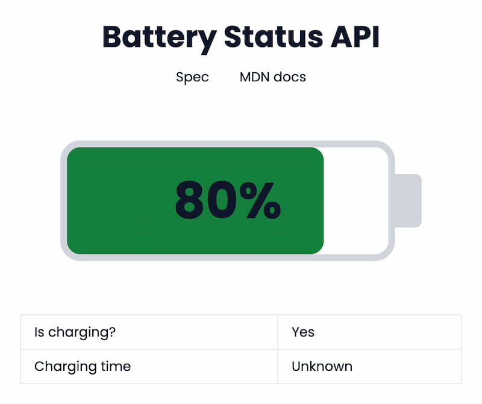

# Battery Status API Demo

Demo application displaying the device's battery status using the [Battery Status API](https://developer.mozilla.org/en-US/docs/Web/API/Battery_Status_API).

✨ [See live version of this demo](https://battery-status-api-demo.netlify.app/) ✨

Built with the following tools:

- [Svelte](https://svelte.dev/)
- [TailwindCSS](https://tailwindcss.com/)
- [Vite](https://vitejs.dev/)



## Features

- Visualize battery level
- Display charging status
- Display charging / discharging time

## Development

```bash
git clone https://github.com/arnellebalane/battery-status-api-demo.git
cd battery-status-api-demo

# run locally
npm run dev

# build for production, deploy `dist` directory
npm run build
```

## Resources

- [Battery Status API specification](https://w3c.github.io/battery/)
- [MDN documentation](https://developer.mozilla.org/en-US/docs/Web/API/Battery_Status_API)

## License

[MIT License](license)
